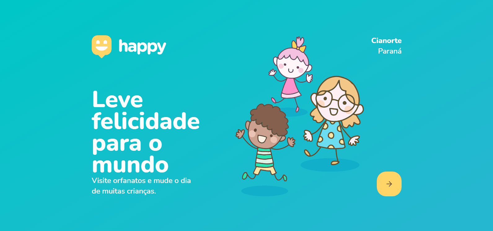

<h1 align="center">
    
</h1>

  <a href="#-technology">Technology</a>&nbsp;&nbsp;&nbsp;|&nbsp;&nbsp;&nbsp;
  <a href="#-project">Project</a>&nbsp;&nbsp;&nbsp;

  
  

## 🚀 Technology

This project was developed with the following technologies:

- [Node.js](https://nodejs.org/en/)
- [React](https://reactjs.org)
- [React Native](https://facebook.github.io/react-native/)
- [Expo](https://expo.io/)
- [TypeScript](https://www.typescriptlang.org/)

## 💻 Project

Happy is an application that connects people to institutional care homes to make many children's day happier 💙

---

<h4>
    Done with 💛 by <a href="https://www.linkedin.com/in/diego-ribeiro-10a14477/" target="_blank">Diego Ribeiro</a>
</h4>
